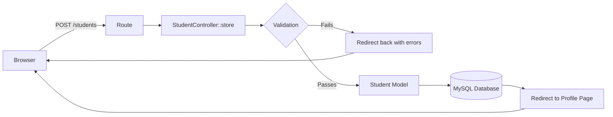
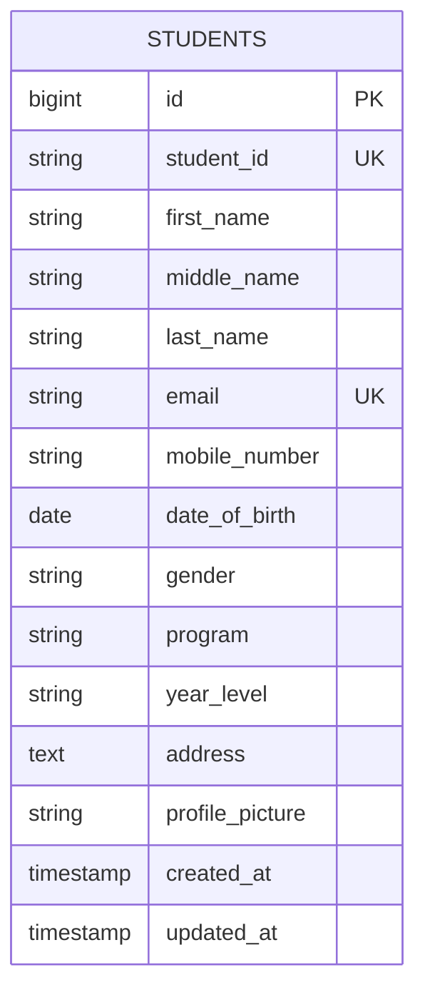
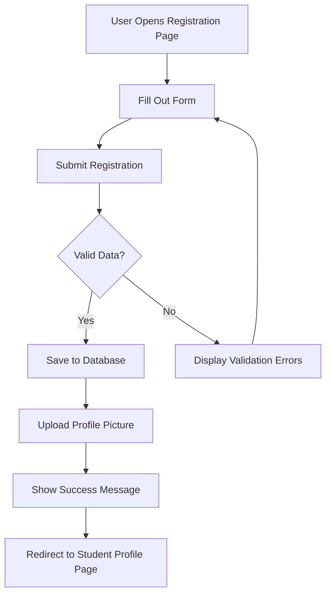

# Student Registration System

A Laravel-based web application for registering, viewing, and managing student records — built for ITST 302 (Week 4 Activity), College of Information Technology.

## Table of Contents

- [Project Title](#project-title)
- [Introduction](#1-introduction)
- [Objectives](#2-objectives)
- [Laravel Request Lifecycle](#3-laravel-request-lifecycle)
- [Validation Rules](#4-validation-rules)
- [Database Design](#5-database-design)
- [Registration Flowchart](#6-registration-flowchart)
- [Screenshots](#7-screenshots)
- [Problems Encountered](#8-problems-i-encountered)
- [Solutions](#9-how-i-solved-them)
- [Reflection](#10-reflection)
- [References](#11-references)

---

## Project Title

**Student Registration System** — a Laravel CRUD application that allows a user to register students, upload their profile pictures, view individual student profiles, and browse the full student registry.

## 1. Introduction

A student registration system is one of the most fundamental modules in any academic institution's information system. It serves as the entry point through which a school collects, validates, and stores the personal, contact, and academic details of every enrollee. The College of Information Technology, which is transitioning from paper-based registration to a digital system, needs a reliable way to replace error-prone paper forms with a structured, auditable, and searchable digital record.

**Data validation** is central to this kind of system. Registration data feeds into grading, billing, communication, and reporting — if a student's email, mobile number, or ID is wrong or duplicated at the point of entry, that error propagates into every downstream process. Server-side validation ensures that no invalid, incomplete, or malicious data reaches the database, regardless of what a user's browser does or does not enforce on the client side.

More broadly, registration systems illustrate a pattern used throughout enterprise software: **collect input, validate it, persist it, confirm it back to the user.** The same request lifecycle used here applies to onboarding forms in banks, patient intake in hospitals, and account creation on any consumer platform. Learning to build one correctly in Laravel is a transferable skill for enterprise web development in general.

## 2. Objectives

By the end of this activity, the following were accomplished:

- Set up a Laravel project with Eloquent models, migrations, controllers, and Blade views.
- Designed and implemented a `students` database table with appropriate data types and constraints.
- Built a multi-section registration form (Personal Information, Contact Information, Academic Information, Profile Photo).
- Implemented server-side validation with `required`, `unique`, `email`, `numeric`, and `image` rules.
- Implemented file upload handling for student profile pictures using Laravel's Storage system.
- Displayed validation errors and success (flash) messages back to the user.
- Created a student registry (index) page and an individual student profile (show) page.
- Practiced using Laravel Artisan commands (`migrate`, `serve`, `storage:link`) for development and debugging.
- Version-controlled the project and published it to GitHub.

## 3. Laravel Request Lifecycle

When a student submits the registration form, the request passes through several distinct layers before a response is returned to the browser.

| Step | Layer | Description |
|---|---|---|
| 1 | Browser | The student fills out the form and submits it as an HTTP `POST` request to `/students`. |
| 2 | Route (`routes/web.php`) | Laravel's router matches the incoming URL and HTTP verb to the `students.store` route. |
| 3 | Controller (`StudentController@store`) | Receives the `Request` object containing all form fields and the uploaded file. |
| 4 | Validation | The controller runs `$request->validate([...])`. If any rule fails, Laravel automatically redirects back to the form with the old input and error messages. |
| 5 | Model (`Student`) | Once validation passes, the file is stored via `Storage`, and a new `Student` record is created through the Eloquent model. |
| 6 | Database | The validated, mass-assigned data is persisted into the `students` table in MySQL. |
| 7 | Response | The controller redirects to the student's profile page with a flash `success` message. |

## 4. Validation Rules

The registration form (`StudentController@store`) enforces the following validation rules:

| Rule | Applied To | Why It Matters |
|---|---|---|
| `required` | `first_name`, `last_name`, `email`, `mobile_number`, `date_of_birth`, `gender`, `program`, `year_level`, `address` | Prevents incomplete records — a student profile is not usable without its core identifying information. |
| `unique:students` | `student_id`, `email` | Stops duplicate enrollments and guarantees each email is tied to only one student account. |
| `email` | `email` | Confirms the field follows a valid email format before it is ever used for notifications. |
| `numeric` | `mobile_number` | Prevents letters or symbols from being stored in a field meant purely for a contact number. |
| `image`, `mimes:jpg,jpeg,png` | `profile_picture` | Blocks non-image files (e.g. scripts or executables) disguised as a profile picture. |
| `max:2048` | `profile_picture` | Caps the upload at 2MB to protect server storage and keep page loads reasonable. |

Validation errors are displayed directly above the form, and previously entered values are retained using Laravel's `old()` helper so the student does not have to retype everything.

## 5. Database Design

### Entity Relationship Diagram

### Table Structure — `students`

| Column | Data Type | Constraints |
|---|---|---|
| id | BIGINT UNSIGNED | Primary Key, Auto Increment |
| student_id | VARCHAR(20) | Unique, Not Null |
| first_name | VARCHAR(100) | Not Null |
| middle_name | VARCHAR(100) | Nullable |
| last_name | VARCHAR(100) | Not Null |
| email | VARCHAR(255) | Unique, Not Null |
| mobile_number | VARCHAR(15) | Not Null |
| date_of_birth | DATE | Not Null |
| gender | VARCHAR(10) | Not Null |
| program | VARCHAR(150) | Not Null |
| year_level | VARCHAR(20) | Not Null |
| address | TEXT | Not Null |
| profile_picture | VARCHAR(255) | Not Null (stores file path only) |
| created_at / updated_at | TIMESTAMP | Auto-managed by Laravel |

**Primary Key:** `id` — an auto-incrementing surrogate key that guarantees every row is uniquely identifiable.

**Constraints:** Unique constraints on `student_id` and `email` are enforced both at the Laravel validation layer and at the database migration level, giving the system two layers of protection against duplicate records.

## 6. Registration Flowchart

## 7. Screenshots

> Replace the placeholders below with actual screenshots saved in the `screenshots/` folder.

| Screenshot | File |
|---|---|
| Registration Form | `screenshots/registration-form.png` |
| Validation Errors | `screenshots/validation-errors.png` |
| Flash Success Message | `screenshots/success-message.png` |
| Uploaded Profile Picture | `screenshots/profile-picture.png` |
| Student Profile Page | `screenshots/student-profile.png` |
| Database Records (phpMyAdmin) | `screenshots/database-records.png` |
| VS Code Project Structure | `screenshots/vscode-structure.png` |
| GitHub Repository | `screenshots/github-repo.png` |
| Terminal Output | `screenshots/terminal-output.png` |
| Browser Output | `screenshots/browser-output.png` |

## 8. Problems I Encountered

1. **`could not find driver` error when running migrations.** The PHP installation I was using (`C:\php`) did not have the `pdo_mysql` extension enabled, so PDO could not connect to MySQL even though my `.env` file was configured correctly.
2. **My migration file was not detected by `php artisan migrate`.** I had accidentally saved a new migration under a placeholder filename (`test123.php`) instead of the proper timestamped Laravel migration filename, so Laravel's migration runner never picked it up.
3. **My form input borders were invisible.** I had used a Tailwind color utility (`border-slate-300`) without the accompanying `border` width utility, so no border rendered even though I had specified a color — I learned Tailwind requires both to actually draw a visible border.
4. **My database was not found on my first migration attempt.** The `student_registration` database I created via phpMyAdmin was not recognized when I ran the migration, so I had to accept Laravel's own prompt to create the database directly.

## 9. How I Solved Them

1. I opened `php.ini` for my active PHP CLI installation and uncommented `extension=pdo_mysql` (and `extension=mysqli`), then verified with `php -m` that both modules had loaded successfully.
2. I renamed my misnamed migration file to the correct Laravel convention (`2024_01_01_000000_create_students_table.php`) so the migration runner could finally detect and execute it.
3. I added the `border` utility class alongside `border-slate-300` on every input, select, and textarea element to make the 1px border actually render.
4. I accepted Laravel's prompt to auto-create the missing database when I ran `php artisan migrate`, which resolved the connection immediately.

## 10. Reflection

Working on this Student Registration System gave me a much clearer picture of what happens between me clicking "Submit" and my data actually landing safely in a database. Before this activity, validation felt like an abstract requirement mentioned in lectures. Building it myself made it concrete: every rule I wrote — `required`, `unique`, `numeric`, `image` — existed to stop a specific, realistic mistake a real user could make, whether that is leaving a field blank, registering with someone else's email, or uploading a file that is not actually an image.

One of the biggest lessons I learned was how much can go wrong outside of the code itself. My validation logic and my Blade templates were correct from early on, yet my system still failed because of environment issues — a missing PHP extension, a misnamed migration file, a database that had not been created yet. This taught me that being a developer is not just about writing correct application code; it is also about understanding the tools underneath it, like PHP's extension system, Composer, and how Laravel's Artisan commands actually talk to the database driver.

I also came to appreciate the difference between client-side and server-side validation. Client-side validation, like HTML5's `required` attribute or JavaScript checks, is helpful for immediate feedback, but I realized it can be bypassed entirely — through browser developer tools, disabled JavaScript, or a direct HTTP request. Server-side validation, which Laravel enforces inside my controller before anything touches the database, is the actual security boundary. No matter how the request arrives, it has to pass through the same rules I wrote. This project reinforced for me that server-side validation is not optional or redundant with client-side checks — it is the only validation I can actually trust.

File security was another area I had not thought carefully about before. If I had simply allowed "any file" to be uploaded as a profile picture, I would have created a serious vulnerability, since a malicious user could disguise a script as an image. Restricting uploads with `image`, `mimes:jpg,jpeg,png`, and a `max` file size, and then storing only the resulting file path in my database rather than the raw file, are small decisions I made that meaningfully reduce risk.

Finally, this project made the real-world relevance of registration systems very tangible to me. Every enterprise system I interact with daily — banking apps, hospital patient portals, e-commerce accounts — relies on the same underlying pattern I built here: collect information, validate it rigorously, store it safely, and confirm success back to the user. Seeing that pattern implemented end-to-end, from my Blade form down to a MySQL row, has made me more confident about tackling the larger Enterprise Laravel E-Commerce Project later this semester.

## 11. References

Laravel. (n.d.). *Laravel 13.x documentation*. Laravel LLC. https://laravel.com/docs

PHP Group. (n.d.). *PHP manual*. https://www.php.net/manual/en/

Oracle Corporation. (n.d.). *MySQL 8.0 reference manual*. https://dev.mysql.com/doc/

Tailwind Labs. (n.d.). *Tailwind CSS documentation*. https://tailwindcss.com/docs

Mozilla Contributors. (n.d.). *MDN Web Docs*. Mozilla Foundation. https://developer.mozilla.org/

---

**Required Diagrams** — all diagrams are also saved in the `documentation/` folder:
- `documentation/registration-flowchart.png` — Registration Flowchart
- `documentation/er-diagram.png` — Database ER Diagram
- `documentation/laravel-request-lifecycle.png` — Laravel Request Lifecycle Diagram